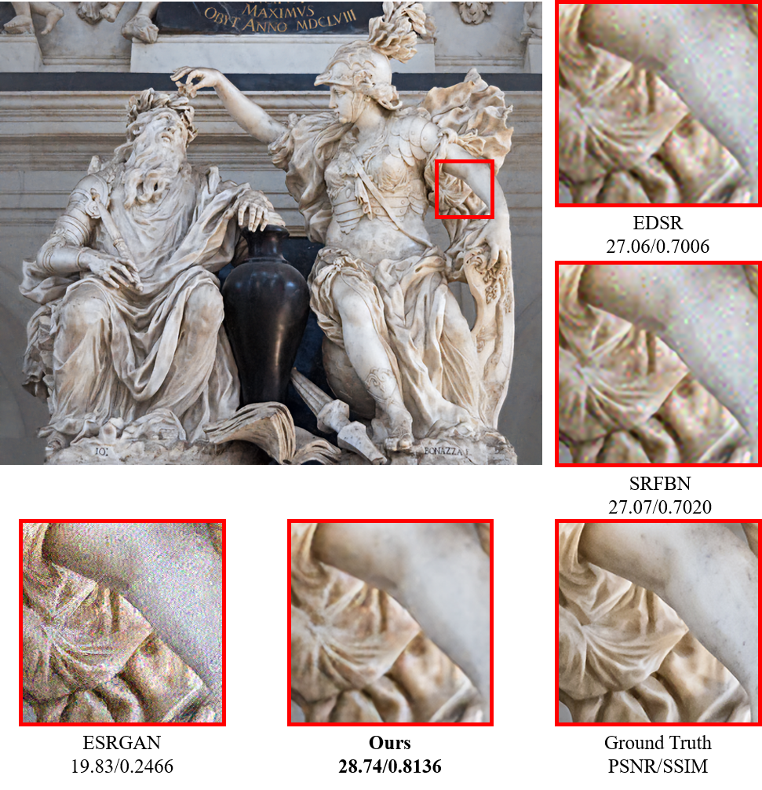

# unsupervised-super-resolution-domain-discriminator
This is a project of CVPR2020 workshop paper "Unsupervised Real-World Super Resolution with Cycle Generative Adversarial Network and Domain Discriminator", which achieved 5th place in NTIRE2020 Real World Super Resolution Challenge Track 1
This code is based on tensorflow implementation of ESRGAN made by hiram64(github.com/hiram64/ESRGAN-tensorflow). Thanks you!

## Dependencies
Python==3.5.2
Numpy==1.17.2
Scipy==1.2.0
OpenCV==3.4.4.19
Tensorflow-gpu==1.12.0

## Train
### Stage 1
