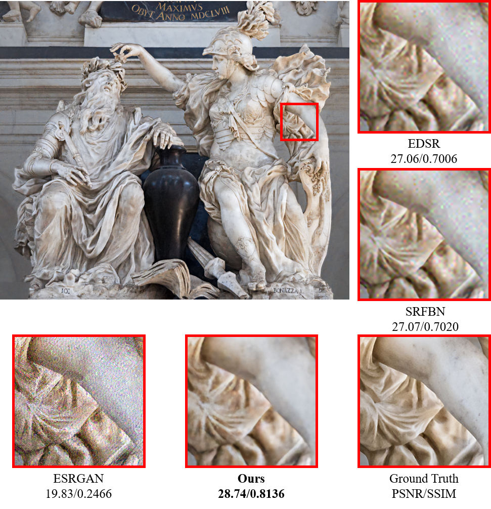

# Unsupervised Real-World Super Resolution with Cycle Generative Adversarial Network and Domain Discriminator(DDGAN)
This is a project of CVPR2020 workshop paper "Unsupervised Real-World Super Resolution with Cycle Generative Adversarial Network and Domain Discriminator", which achieved 5th place in NTIRE2020 Real World Super Resolution Challenge Track 1.

This code is based on tensorflow implementation of ESRGAN made by hiram64(github.com/hiram64/ESRGAN-tensorflow). Thank you!

## Dependencies
Python==3.5.2
Numpy==1.17.2
Scipy==1.2.0
OpenCV==3.4.4.19
Tensorflow-gpu==1.12.0

## Train
### Stage 1-1

\fbox{python pre_train1.py}

### Stage 1-2

python pre_train2.py

### Stage 2

python main_train.py

## Evaluate
### Track 1
python test.py --data_dir ./data/track1/ --checkpoint_dir ./checkpoint_track1/ --test_result_dir ./test_result_track1
### Track 2
python test.py --data_dir ./data/track2/ --checkpoint_dir ./checkpoint_track2/ --test_result_dir ./test_result_track2

## Pretrained model

training with NTIRE2020 real world super-resolution challenge track 1 dataset

https://drive.google.com/file/d/1gxeDJxj91fgEpeZz3mFNwlUvVxKp649v/view?usp=sharing

training with NTIRE2020 real world super-resolution challenge track 2 dataset

https://drive.google.com/file/d/12xxgn3Q-CctltH9FZw2ZGmWhbaO7iBeS/view?usp=sharing
